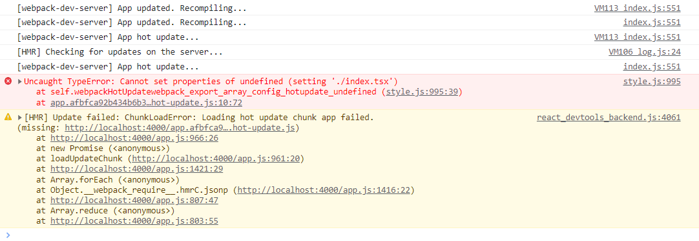
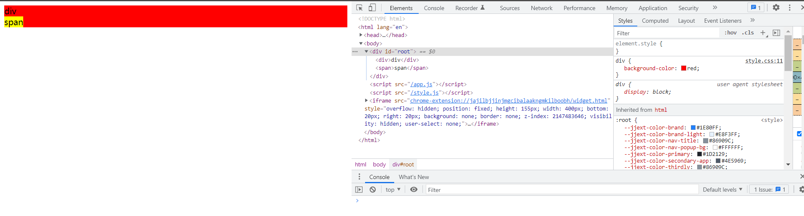
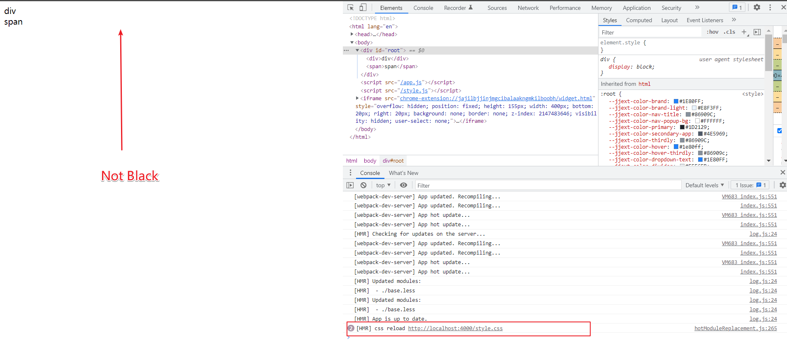

# `Uncaught TypeError: Cannot set properties of undefined` reproducible repo

This repo can be used to reproduce the error reported in [webpack issues](https://github.com/webpack/webpack/issues/15988).

## Environment

- Windows 10 Chrome
- Node v16.15.1
- typescript 4.4.2,
- webpack 5.73.0,
- webpack-cli 4.7.0,
- webpack-dev-server 4.9.2,
- esbuild-loader 2.13.1,
- css-loader 6.7.1
- got 11.8.0,
- koa 2.4.1,
- koa-router 7.3.0,
- ejs 2.5.7,
- less 4.1.2,
- less-loader 10.2.0,
- mini-css-extract-plugin 2.6.0

## Steps to Reproduce the first problem(tsx hot update)

1. Clone repo
2. Run `yarn`
3. Run `yarn start`
4. Visit <https://localhost:4000>
5. Open web developer console and observe everything is looking good
6. Edit `index.tsx` to output something and save
7. Observe the error:

```
Uncaught TypeError: Cannot set properties of undefined (setting './index.tsx')
    at self.webpackHotUpdatewebpack_export_array_config_hotupdate_undefined (style.js:995:39)
    at app.391074dbbe1b3ec93274.hot-update.js:10:72
```

8. HMR update fail



## Steps to Reproduce the second problem(less hot update)

1.Same as the previous five steps above

2.Before editing base.less



3.Edit `base.less` background-color to black and save



4.HMR is worked, but styles doesn't seem to be working
